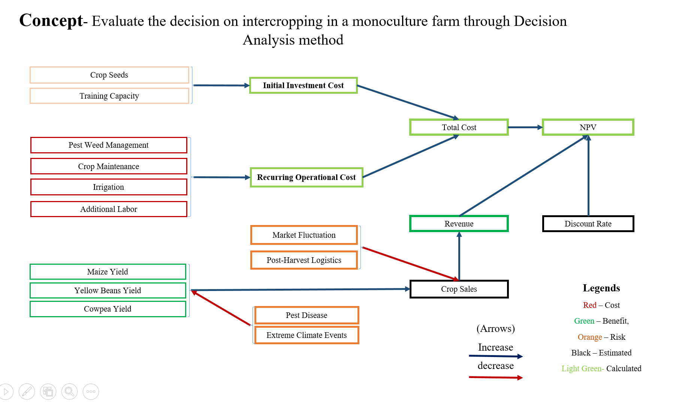

    
```{r setup, include=FALSE}
    knitr::opts_chunk$set(echo = TRUE)
``` 

# Evaluate the decision on intercropping in a monoculture farm through Decision Analysis method


## Decision Problem 

Agricultural productivity is declining in many regions globally, with Sub-Saharan Africa being particularly affected due to the combined impacts of climate change, unsustainable farming practices, and land fragmentation. In Kitui County, Kenya, these challenges are further compounded by erratic rainfall patterns and recurrent droughts. Smallholder farmers in the region predominantly rely on rainfed maize monoculture systems. Due to high levels of poverty, most farmers are unable to afford synthetic fertilizers; among those who do, excessive and inappropriate use has contributed to soil acidification and nutrient imbalances, further reducing land productivity. 
In response, the NGO XYZ is implementing a regenerative agriculture (RA) initiative aimed at restoring soil health and enhancing productivity. The proposed intervention includes the application of soil organic amendments (compost and green manure) and intercropping systems involving maize with nitrogen-fixing legumes (yellow beans and cowpeas) as cover crops. These practices are intended to improve soil organic matter, enhance nutrient cycling, and increase resilience to climatic variability.
However, the adoption of these practices poses a critical decision-making challenge for smallholder farmers, who are currently at a crossroads, uncertain whether to transition to regenerative agriculture practices or continue relying on the conventional rainfed maize monoculture system.

<br>

## Decision Context

**1. Primary Decision:** Should smallholder farmers adopt regenerative agriculture practices, specifically intercropping with soil organic amendments, or continue with conventional rainfed maize monoculture?

**2. Decision Makers:** Smallholder farmers in Kitui County, Kenya 

**3. Key Stakeholders:** Peer farmers, XYZ, other NGOs, retailers, local government authorities, community-based organizations, agricultural extension officers, and policymakers in the agricultural sector

**4. Project duration:** 7 years, encompassing phases of introduction, scaling, monitoring, and evaluation of regenerative agriculture interventions




```{r cars}
summary(cars)
```

### Including Plots

You can also embed plots, for example:

```{r pressure, echo=TRUE}
plot(pressure)
```

Note that the `echo = FAmLSE` parameter was added to the code chunk to prevent printing of the R code that generated the plot.
