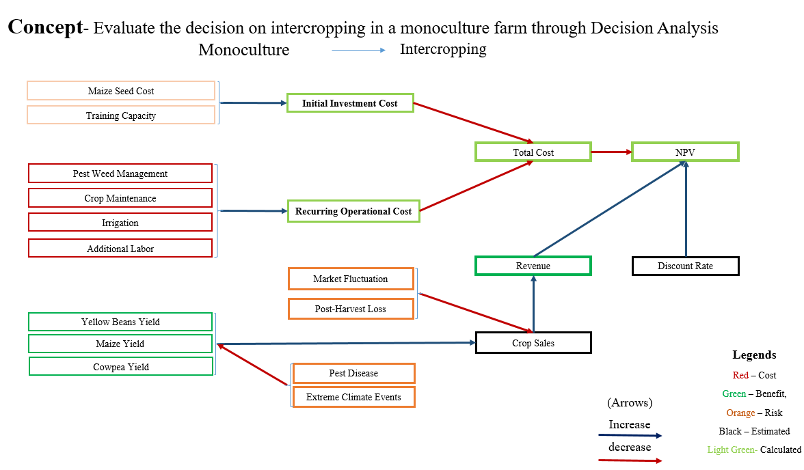

```{r setup, include=FALSE}
# Load required packages and global options
knitr::opts_chunk$set(
  echo = TRUE,
  warning = FALSE,
  message = FALSE,
  fig.width = 7,
  fig.height = 5
)
library(decisionSupport)
library(ggplot2)
library(dplyr)
library(purrr)
library(pls)

# Helper to calculate VIP scores for PLSR models
calculate_vip <- function(model) {
  W  <- model$loading.weights
  Tm <- model$scores
  Q  <- model$Yloadings
  SS <- (Q^2) * colSums(Tm^2)
  W2 <- W^2
  vip <- sqrt(
    nrow(W) *
    rowSums(sweep(W2, 2, SS/colSums(W2), "*")) /
    sum(SS)
  )
  names(vip) <- rownames(W)
  vip
}
```

# Introduction

Agricultural productivity is declining in many regions globally, with Sub-Saharan Africa being particularly affected due to the combined impacts of climate change, unsustainable farming practices, and land fragmentation. In Kitui County, Kenya, located in the semi-arid region of Eastern Kenya, these challenges are further compounded by erratic rainfall patterns and recurrent droughts. Smallholder farmers in the region predominantly rely on rainfed maize monoculture systems. Due to high levels of poverty, most farmers are unable to afford synthetic fertilizers; among those who do, excessive and inappropriate use has contributed to soil acidification and nutrient imbalances, further reducing land productivity.  The proposed intervention includes the application of intercropping systems involving maize with nitrogen-fixing legumes (yellow beans and cowpeas) as cover crops , while acknowledging the inherent risks associated with pest and disease outbreaks, extreme climate events, all of which can impact overall profitability and the success of crop sales. These practices are intended to improve soil organic matter, enhance nutrient cycling, and increase resilience to climatic variability. However, the adoption of these practices poses a critical decision-making challenge for smallholder farmers, who are currently at a crossroads, uncertain whether to transition to Intercropping practices or continue relying on the conventional maize monoculture system. This report presents a comparative decision analysis of these two systems using a Monte Carlo simulation model.

## Decision Context

Primary Decision: Should smallholder farmers adopt regenerative agriculture practices, specifically intercropping with soil organic amendments, or continue with conventional maize monoculture?
Decision Makers: Smallholder farmers in Kitui County, Kenya 
Key Stakeholders: Peer farmers, local government authorities, community-based organizations, agricultural extension officers, and policymakers in the agricultural sector
Project duration: 7 years, encompassing phases of introduction, scaling, monitoring, and evaluation of the  intervention
Farm Size: 10 acres 

## Objectives
- To estimate the net present value (NPV) and profitability of maize monoculture and legume+maize intercropping over a 7-year period.
- To analyze risks associated with pests, climate variability, and market fluctuations.
- To assess which variables most influence decision-making through EVPI (Expected Value of Perfect Information).




#  Data and Inputs

We begin by loading the input parameters from a CSV file. This table should include means, coefficients of variation, and correlation structure for seed costs, yields, prices, pest/disease risks, climate event probabilities, and other cost items.

```{r load-inputs}
# Read the unified input table
input_data <- read.csv("data/Input_File.csv", stringsAsFactors = FALSE)
# Convert to decisionSupport estimate object
estimates <- as.estimate(input_data)
```

#  Monte Carlo Simulation Model

##  Sampling Function

We define a helper to draw a single Monte Carlo sample and assign variables in the global environment.

```{r sampling-func}
make_variables <- function(est, n = 1) {
  x <- random(rho = est, n = n)
  for (nm in colnames(x)) {
    assign(nm, as.numeric(x[1, nm]), envir = .GlobalEnv)
  }
}
# Draw initial sample (for testing purposes)
make_variables(estimates)
```

##  Core Model Function

The `model_function()` computes time-series of costs, revenues, cashflows, and NPVs for both monoculture and intercropping scenarios over the planning horizon (`n_years`).

```{r model-function}
model_function <- function() {
  #project planning
  n_years <- 7
  ### Monoculture: Initial cost
  
  mono_seed_ts <- vv(Maize_Seeds_Cost, var_CV = var_CV, n = n_years)
  
  ### Monoculture: Recurring costs  
  mono_recur_val <- Pest_Weed_Management_Mono + Crop_Maintenance_Mono +
    Irrigation_Mono
  pest_mono <- vv(Pest_Weed_Management_Mono, var_CV = var_CV, n = n_years)
  cropm_mono <- vv(Crop_Maintenance_Mono, var_CV = var_CV, n = n_years)
  irr_mono <- vv(Irrigation_Mono, var_CV = var_CV, n = n_years)
  mono_recur_ts  <- c( vv(var_mean = mono_recur_val,
                          var_CV = var_CV, n = n_years), 0)
  mono_cost_ts   <- mono_seed_ts + pest_mono + cropm_mono + irr_mono
  
  ### Monoculture: Pest & climate adjustments
  mono_pest_ts    <- chance_event(
    chance       = Pest_Disease_Chance_MY,
    value_if     = Maize_Yield * (1 - Pest_Disease_Effect_MY),
    value_if_not = Maize_Yield,
    n            = n_years )
  
  mono_climate_ts <- chance_event(
    chance       = Extreme_Climate_Chance_MY,
    value_if     = mono_pest_ts * (1 - Extreme_Climate_Events_MY),
    value_if_not = mono_pest_ts,
    n            = n_years )
  
  ### Monoculture: Revenue after losses
  mono_rev_base_ts <- vv(
    var_mean = mono_climate_ts * Maize_Price,
    var_CV   = var_CV,
    n        = n_years )
  mono_phl_factor  <- chance_event(
    chance       = Post_Harvest_Losses,
    value_if     = 1 - Reduction_Sale_PHL,
    value_if_not = 1,
    n            = n_years )
  mono_mf_factor   <- chance_event(
    chance       = Market_Fluctuation,
    value_if     = 1 - Reduction_Sales_MF,
    value_if_not = 1,
    n            = n_years )
  
  mono_rev_ts      <- mono_rev_base_ts * mono_phl_factor * mono_mf_factor
  
  ### Monoculture: Cashflow & NPV
  Cashflow_Monoculture    <- mono_rev_ts - mono_cost_ts 
  CumCashflow_Monoculture <- cumsum(Cashflow_Monoculture)
  NPV_Monoculture         <- discount(Cashflow_Monoculture,
                                      discount_rate = discount_rate,
                                      calculate_NPV = TRUE)
  
  ## -- Intercropping intervention --
  
  ### Intercropping intervention: Initial investment
  int_seed_ts <- vv(Total_Seeds_Cost, var_CV = var_CV, n = n_years)
  ini_int_investment <- Training_Capacity_Int
  # Training Capacity reducing from the 2nd year in a relative trend
  int_initial_investment_val <- vv( var_mean      = Training_Capacity_Int,
                                    var_CV         = 0,
                                    n              = n_years,
                                    relative_trend = -40 )
  ini_int_cost <- int_initial_investment_val + int_seed_ts
  
  ### Intercropping: Recurring costs
  
  int_recur_val <- Pest_Weed_Management_Int + Crop_Maintenance_Int +
    Irrigation_Int + Additional_Labor_Int
  pest_int <- vv(Pest_Weed_Management_Int, var_CV = var_CV, n = n_years)
  cropm_int <- vv(Crop_Maintenance_Int, var_CV = var_CV, n = n_years)
  irr_int <- vv(Irrigation_Int, var_CV = var_CV, n = n_years)
  addl_int <- vv(Additional_Labor_Int, var_CV = var_CV, n = n_years)
  int_recur_ts  <- c( vv(var_mean = int_recur_val, var_CV = var_CV,
                         n = n_years), 0)
  int_cost_ts   <- ini_int_cost + pest_int + cropm_int + irr_int + addl_int
  
  ### Intercropping: Pest & climate adjustments
  maize_adj_ts  <- chance_event(
    chance       = Pest_Disease_Chance_MY,
    value_if     = Maize_Yield * (1 - Pest_Disease_Effect_MY),
    value_if_not = Maize_Yield,
    n            = n_years )
  maize_cl_ts   <- chance_event(
    chance       = Extreme_Climate_Chance_MY,
    value_if     = maize_adj_ts * (1 - Extreme_Climate_Events_MY),
    value_if_not = maize_adj_ts,
    n            = n_years )
  cowpea_adj_ts <- chance_event(
    chance       = Pest_Disease_Chance_CY,
    value_if     = Cowpea_Yield * (1 - Pest_Disease_Effect_CY),
    value_if_not = Cowpea_Yield,
    n            = n_years )
  cowpea_cl_ts  <- chance_event(
    chance       = Extreme_Climate_Chance_CY,
    value_if     = cowpea_adj_ts * (1 - Extreme_Climate_Events_CY),
    value_if_not = cowpea_adj_ts,
    n            = n_years )
  yellow_adj_ts <- chance_event(
    chance       = Pest_Disease_Chance_YB,
    value_if     = Yellow_Beans_Yield * (1 - Pest_Disease_Effect_YB),
    value_if_not = Yellow_Beans_Yield,
    n            = n_years )
  yellow_cl_ts  <- chance_event( 
    chance       = Extreme_Climate_Chance_YB,
    value_if     = yellow_adj_ts * (1 - Extreme_Climate_Events_YB),
    value_if_not = yellow_adj_ts,
    n            = n_years)
  
  
  ### Intercropping: Revenue after losses
  int_rev_base_ts <- vv( var_mean = (maize_cl_ts * Maize_Price) +
                           (cowpea_cl_ts * Cowpea_Price) +
                           (yellow_cl_ts * Yellow_Beans_Price),
                         var_CV   = var_CV,
                         n        = n_years )
  int_phl_factor  <- chance_event(
    chance       = Post_Harvest_Losses,
    value_if     = 1 - Reduction_Sale_PHL,
    value_if_not = 1,
    n            = n_years )
  int_mf_factor   <- chance_event(
    chance       = Market_Fluctuation,
    value_if     = 1 - Reduction_Sales_MF,
    value_if_not = 1,
    n            = n_years )
  int_rev_ts      <- int_rev_base_ts * int_phl_factor * int_mf_factor
  
  
  ### Intercropping: Cashflow & NPV
  Cashflow_Intercropping    <- int_rev_ts - int_cost_ts
  CumCashflow_Intercropping <- cumsum(Cashflow_Intercropping)
  NPV_Intercropping         <- discount(Cashflow_Intercropping,
                                        discount_rate = discount_rate,
                                        calculate_NPV = TRUE)
  
  ### Decision difference: Profit, cashflow, cumulative
  Cashflow_Decision    <- Cashflow_Intercropping - Cashflow_Monoculture
  CumCashflow_Decision <- cumsum(Cashflow_Decision)
  NPV_Decision         <- NPV_Intercropping - NPV_Monoculture
  
  CumCashflow_Monoculture   <- cumsum(Cashflow_Monoculture)
  CumCashflow_Intercropping <- cumsum(Cashflow_Intercropping)
  CumCashflow_Decision      <- cumsum(Cashflow_Decision)
  
  
  ## Return all outputs
  return(list(
    NPV_Monoculture           = NPV_Monoculture,
    NPV_Intercropping         = NPV_Intercropping,
    NPV_Decision              = NPV_Decision,
    Cashflow_Monoculture      = Cashflow_Monoculture,
    Cashflow_Intercropping    = Cashflow_Intercropping,
    Cashflow_Decision         = Cashflow_Decision,
    CumCashflow_Monoculture   = CumCashflow_Monoculture,
    CumCashflow_Intercropping = CumCashflow_Intercropping,
    CumCashflow_Decision      = CumCashflow_Decision
  ))
  
}
```

#  Running Monte Carlo Simulation

We perform 10,000 simulation runs to capture uncertainty in costs, yields, and external risk factors.

```{r run-simulation}
set.seed(2025)
combined_simulation <- mcSimulation(
  estimate          = estimates,
  model_function    = model_function,
  numberOfModelRuns = 100,
  functionSyntax    = "plainNames")
```
#  Results and Visualization

##  Distribution of NPVs

```{r plot-distributions}
# Plot distributions for each scenario
plot_distributions(mcSimulation_object = combined_simulation,
  vars                = "NPV_Monoculture",
  method              = "boxplot_density",
  base_size           = 7,
  x_axis_name         = "Outcome distribution (USD/acre)")

plot_distributions(mcSimulation_object = combined_simulation,
  vars                = "NPV_Intercropping",
  method              = "boxplot_density",
  base_size           = 7,
  x_axis_name         = "Outcome distribution (USD/acre)")

plot_distributions(mcSimulation_object = combined_simulation,
  vars                = "NPV_Decision",
  method              = "boxplot_density",
  base_size           = 7,
  x_axis_name         = "Outcome distribution (USD/acre)")

plot_distributions(mcSimulation_object = combined_simulation,
  vars                = c("NPV_Monoculture", "NPV_Intercropping"),
  method              = "smooth_simple_overlay",
  base_size           = 7,
  x_axis_name         = "Outcome distribution (USD/acre)")
```

##  Annual and Cumulative Cashflows

```{r plot-cashflow}
# Annual profit time series for both scenarios
plot_cashflow(
  mcSimulation_object = combined_simulation,
  cashflow_var_name   = c("Cashflow_Monoculture", "Cashflow_Intercropping"),
  x_axis_name         = "Year",
  y_axis_name         = "Annual Profit (USD/acre)",
  color_25_75         = "blue",
  color_5_95          = "lightblue",
  color_median        = "darkblue",
  facet_labels        = c("Monoculture", "Intercropping")
)

# Cumulative annual profit time series
plot_cashflow(
  mcSimulation_object = combined_simulation,
  cashflow_var_name   = c("CumCashflow_Monoculture", "CumCashflow_Intercropping"),
  x_axis_name         = "Year",
  y_axis_name         = "Cumulative Profit (USD/acre)",
  color_25_75         = "blue",
  color_5_95          = "lightblue",
  color_median        = "darkblue",
  facet_labels        = c("Monoculture", "Intercropping")
)
```

## EVPI Analysis

```{r evpi-analysis}
# Prepare EVPI dataset
df_evpi <- data.frame(combined_simulation$x,
  NPV_Decision = combined_simulation$y[, "NPV_Decision"])

# Compute EVPI
EVPI_results <- multi_EVPI(
  mc            = df_evpi,
  first_out_var = "NPV_Decision")

# Print and plot EVPI
print(EVPI_results)
plot_evpi(EVPIresults   = EVPI_results,
  decision_vars = "NPV_Decision")
```

## Variable Importance (VIP)

```{r vip-analysis}
pls_data <- data.frame(combined_simulation$x,
                       NPV_Decision = combined_simulation$y[, "NPV_Decision"]) %>%
  select_if(~ var(.) > 0)
pls_model <- plsr(NPV_Decision ~ ., data = pls_data,
                  scale = TRUE, validation = "CV", segments = 10, jackknife = TRUE)
opt_comp <- which.min(RMSEP(pls_model)$val[1,,]) - 1
vip_scores <- calculate_vip(pls_model)
vip_df <- tibble(Variable = names(vip_scores), VIP = vip_scores) %>%
  arrange(desc(VIP))
# Plot top 15
ggplot(head(vip_df, 15), aes(reorder(Variable, VIP), VIP)) +
  geom_col(fill = "#E15759", alpha = 0.8) +
  geom_hline(yintercept = 1, linetype = "dashed", color = "red") +
  coord_flip() +
  labs(title = "VIP Scores (Top 15)", subtitle = paste(opt_comp, "PLS components")) +
  theme_minimal()
```

# Discussion

The findings from this decision analysis overwhelmingly support intercropping as a financially superior and more robust agricultural practice compared to monoculture. The substantial and sustained increase in both annual and cumulative profits, along with the higher NPV distribution for intercropping, presents a compelling economic case for its adoption. 
This financial advantage can be attributed to the inherent benefits of diversification, which include reduced risk from single crop failure, more efficient utilization of resources (e.g., land, water, nutrients), and potential for improved soil health over time.The analysis of different cashflow scenarios further refines these insights. 
The Variable Importance in Projection (VIP) scores provide critical strategic insights for optimizing intercropping systems in Kitui County (Figure7). The importance of Cowpea and Yellow Beans prices and yields cannot be overlooked. The significant VIP score for Reduction of Sales for Post Harvest loses underscores that even with high yields, economic benefits can be lost due to poor post-harvest practices. Interventions focusing on appropriate drying, storage, and processing technologies are vital to minimize losses.
The monoculture scenario (Figure 4) demonstrates its vulnerability, where price fluctuations pose a major threat to profitability, as indicated by the high importance of Price(USD\Kg) and its high EVPI. This suggests that monoculture systems are highly sensitive to market volatility, emphasizing the need for robust price forecasting or risk mitigation strategies

# Conclusion
Based on the robust decision analysis and simulation results, the proposed intercropping intervention, integrating maize with nitrogen-fixing legumes (yellow beans and cowpeas), is strongly recommended for implementation in Kitui County, Kenya. This system demonstrably offers significantly higher annual and cumulative profits and a superior Net Present Value compared to traditional monoculture, indicating a pathway to improved farmer livelihoods and agricultural sustainability in the region.

# References


