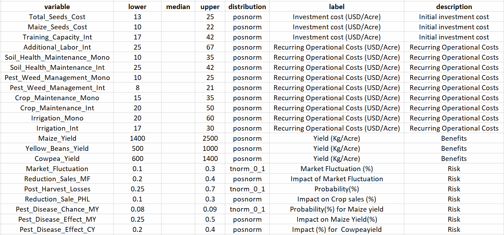

<div style="text-align: justify;">

```{r setup, include=FALSE}
knitr::opts_chunk$set(
  echo = TRUE, warning = FALSE, message = FALSE,
  fig.width = 7, fig.height = 5
)
library(decisionSupport)
library(ggplot2)
library(dplyr)
library(purrr)
library(pls)

# Helper to calculate VIP scores for PLSR models
calculate_vip <- function(model) {
  W  <- model$loading.weights
  Tm <- model$scores
  Q  <- model$Yloadings
  SS <- (Q^2) * colSums(Tm^2)
  W2 <- W^2
  vip <- sqrt(
    nrow(W) *
    rowSums(sweep(W2, 2, SS/colSums(W2), "*")) /
    sum(SS)
  )
  names(vip) <- rownames(W)
  vip
}
```

# **INTRODUCTION**

Agricultural productivity is declining in many regions globally, with Sub-Saharan Africa being particularly affected due to the combined impacts of climate change, unsustainable farming practices, and land fragmentation [@awazi_enhancing_2019]. In Kitui County, Kenya, located in the semi-arid region of Eastern Kenya, these challenges are further compounded by erratic rainfall patterns and recurrent droughts. Smallholder farmers in the region predominantly rely on rainfed maize monoculture systems. Due to high levels of poverty, most farmers are unable to afford synthetic fertilizers; among those who do, excessive and inappropriate use has contributed to soil acidification and nutrient imbalances, further reducing land productivity [@ali-olubandwa_challenges_2011]. The proposed intervention includes the application of intercropping systems involving maize with nitrogen-fixing legumes (yellow beans and cowpeas) as cover crops, while acknowledging the inherent risks associated with pest and disease outbreaks, extreme climate events, all of which can impact overall profitability and the success of crop sales. These practices are intended to improve soil organic matter, enhance nutrient cycling, and increase resilience to climatic variability [@mupangwa_maize_2021]. However, the adoption of these practices poses a critical decision-making challenge for smallholder farmers, who are currently at a crossroads, uncertain whether to transition to Intercropping practices or continue relying on the conventional maize monoculture system. This report presents a comparative decision analysis of these two systems using a Monte Carlo simulation model. 

## **Decision Context**

**Primary Decision:** Should smallholder farmers adopt regenerative agriculture practices, specifically intercropping with soil organic amendments, or continue with conventional maize monoculture?

**Decision Makers:** Smallholder farmers in Kitui County, Kenya.

**Key Stakeholders:** Peer farmers, local government authorities, community-based organizations, agricultural extension officers, and policymakers in the agricultural sector.

**Project duration:** 7 years, encompassing phases of introduction, scaling, monitoring, and evaluation of the  intervention.

**Farm Size:** 10 acres.

## **Objectives**

The main objectives of this projects are-

i) to estimate the net present value (NPV) and profitability of maize monoculture and legume+maize intercropping over a 7-year period.
ii) to analyze risks associated with pests, climate variability, and market fluctuations.
iii) to assess which variables most influence decision-making through EVPI (Expected Value of Perfect Information).

```{r impact-pathway, echo=FALSE, fig.align='center', out.width='70%', fig.cap='**Figure 1**: Impact Pathway Model'}
knitr::include_graphics("photos/Conceptual_Model.png")
```

# **DATA AND INPUTS**

We begin by loading the input parameters from a CSV file. This table should include means, coefficients of variation, and correlation structure for seed costs, yields, prices, pest/disease risks, climate event probabilities, and other cost items.

```{r load-inputs}
# Read the unified input table
input_data <- read.csv("data/Input_File.csv", stringsAsFactors = FALSE)
# Convert to decisionSupport estimate object
estimates <- as.estimate(input_data)
```

```{r input-table, echo=FALSE, fig.align='center', out.width='70%', fig.cap='**Figure 2**: Input table for all variables'}

```

# **MONTE CARLO SIMULATION MODEL**

Parameter estimates were compiled from literature, expert elicitation, and field data relevant to Kitui. These included input costs, crop yields, price data, and risks (pest, climate, and market). A Monte Carlo simulation model was built in R using the Decision Support package built by [@luedeling_decisionsupport_2017]. Two scenarios were simulated over a 7-year period.

## **Sampling Function**

This subsection describes the make_variables  helper function, which draws a single Monte Carlo sample and assigns variable values for the simulation in the global environment.

```{r sampling-func}
make_variables <- function(est, n = 1) {
  x <- random(rho = est, n = n)
  for (nm in colnames(x)) {
    assign(nm, as.numeric(x[1, nm]), envir = .GlobalEnv)
  }
}
# Draw initial sample (for testing purposes)
make_variables(estimates)
```

## **Core Model Function**

This subsection details the model function, which computes a time series of costs, revenues, cashflows, and Net Present Values (NPVs) for both monoculture and intercropping scenarios over a 7-year planning horizon.

```{r model-function}
model_function <- function() {
  #project planning
  n_years <- 7
  ### Monoculture: Initial cost
  
  mono_seed_ts <- vv(Maize_Seeds_Cost, var_CV = var_CV, n = n_years)
  
  ### Monoculture: Recurring costs  
  mono_recur_val <- Pest_Weed_Management_Mono + Crop_Maintenance_Mono +
    Irrigation_Mono
  pest_mono <- vv(Pest_Weed_Management_Mono, var_CV = var_CV, n = n_years)
  cropm_mono <- vv(Crop_Maintenance_Mono, var_CV = var_CV, n = n_years)
  irr_mono <- vv(Irrigation_Mono, var_CV = var_CV, n = n_years)
  mono_recur_ts  <- c( vv(var_mean = mono_recur_val,
                          var_CV = var_CV, n = n_years), 0)
  mono_cost_ts   <- mono_seed_ts + pest_mono + cropm_mono + irr_mono
  
  ### Monoculture: Pest & climate adjustments
  mono_pest_ts    <- chance_event(
    chance       = Pest_Disease_Chance_MY,
    value_if     = Maize_Yield * (1 - Pest_Disease_Effect_MY),
    value_if_not = Maize_Yield,
    n            = n_years )
  
  mono_climate_ts <- chance_event(
    chance       = Extreme_Climate_Chance_MY,
    value_if     = mono_pest_ts * (1 - Extreme_Climate_Events_MY),
    value_if_not = mono_pest_ts,
    n            = n_years )
  
  ### Monoculture: Revenue after losses
  mono_rev_base_ts <- vv(
    var_mean = mono_climate_ts * Maize_Price,
    var_CV   = var_CV,
    n        = n_years )
  mono_phl_factor  <- chance_event(
    chance       = Post_Harvest_Losses,
    value_if     = 1 - Reduction_Sale_PHL,
    value_if_not = 1,
    n            = n_years )
  mono_mf_factor   <- chance_event(
    chance       = Market_Fluctuation,
    value_if     = 1 - Reduction_Sales_MF,
    value_if_not = 1,
    n            = n_years )
  
  mono_rev_ts      <- mono_rev_base_ts * mono_phl_factor * mono_mf_factor
  
  ### Monoculture: Cashflow & NPV
  Cashflow_Monoculture    <- mono_rev_ts - mono_cost_ts 
  CumCashflow_Monoculture <- cumsum(Cashflow_Monoculture)
  NPV_Monoculture         <- discount(Cashflow_Monoculture,
                                      discount_rate = discount_rate,
                                      calculate_NPV = TRUE)
  
  ## -- Intercropping intervention --
  
  ### Intercropping intervention: Initial investment
  int_seed_ts <- vv(Total_Seeds_Cost, var_CV = var_CV, n = n_years)
  ini_int_investment <- Training_Capacity_Int
  # Training Capacity reducing from the 2nd year in a relative trend
  int_initial_investment_val <- vv( var_mean      = Training_Capacity_Int,
                                    var_CV         = 0,
                                    n              = n_years,
                                    relative_trend = -40 )
  ini_int_cost <- int_initial_investment_val + int_seed_ts
  
  ### Intercropping: Recurring costs
  
  int_recur_val <- Pest_Weed_Management_Int + Crop_Maintenance_Int +
    Irrigation_Int + Additional_Labor_Int
  pest_int <- vv(Pest_Weed_Management_Int, var_CV = var_CV, n = n_years)
  cropm_int <- vv(Crop_Maintenance_Int, var_CV = var_CV, n = n_years)
  irr_int <- vv(Irrigation_Int, var_CV = var_CV, n = n_years)
  addl_int <- vv(Additional_Labor_Int, var_CV = var_CV, n = n_years)
  int_recur_ts  <- c( vv(var_mean = int_recur_val, var_CV = var_CV,
                         n = n_years), 0)
  int_cost_ts   <- ini_int_cost + pest_int + cropm_int + irr_int + addl_int
  
  ### Intercropping: Pest & climate adjustments
  maize_adj_ts  <- chance_event(
    chance       = Pest_Disease_Chance_MY,
    value_if     = Maize_Yield * (1 - Pest_Disease_Effect_MY),
    value_if_not = Maize_Yield,
    n            = n_years )
  maize_cl_ts   <- chance_event(
    chance       = Extreme_Climate_Chance_MY,
    value_if     = maize_adj_ts * (1 - Extreme_Climate_Events_MY),
    value_if_not = maize_adj_ts,
    n            = n_years )
  cowpea_adj_ts <- chance_event(
    chance       = Pest_Disease_Chance_CY,
    value_if     = Cowpea_Yield * (1 - Pest_Disease_Effect_CY),
    value_if_not = Cowpea_Yield,
    n            = n_years )
  cowpea_cl_ts  <- chance_event(
    chance       = Extreme_Climate_Chance_CY,
    value_if     = cowpea_adj_ts * (1 - Extreme_Climate_Events_CY),
    value_if_not = cowpea_adj_ts,
    n            = n_years )
  yellow_adj_ts <- chance_event(
    chance       = Pest_Disease_Chance_YB,
    value_if     = Yellow_Beans_Yield * (1 - Pest_Disease_Effect_YB),
    value_if_not = Yellow_Beans_Yield,
    n            = n_years )
  yellow_cl_ts  <- chance_event( 
    chance       = Extreme_Climate_Chance_YB,
    value_if     = yellow_adj_ts * (1 - Extreme_Climate_Events_YB),
    value_if_not = yellow_adj_ts,
    n            = n_years)
  
  
  ### Intercropping: Revenue after losses
  int_rev_base_ts <- vv( var_mean = (maize_cl_ts * Maize_Price) +
                           (cowpea_cl_ts * Cowpea_Price) +
                           (yellow_cl_ts * Yellow_Beans_Price),
                         var_CV   = var_CV,
                         n        = n_years )
  int_phl_factor  <- chance_event(
    chance       = Post_Harvest_Losses,
    value_if     = 1 - Reduction_Sale_PHL,
    value_if_not = 1,
    n            = n_years )
  int_mf_factor   <- chance_event(
    chance       = Market_Fluctuation,
    value_if     = 1 - Reduction_Sales_MF,
    value_if_not = 1,
    n            = n_years )
  int_rev_ts      <- int_rev_base_ts * int_phl_factor * int_mf_factor
  
  
  ### Intercropping: Cashflow & NPV
  Cashflow_Intercropping    <- int_rev_ts - int_cost_ts
  CumCashflow_Intercropping <- cumsum(Cashflow_Intercropping)
  NPV_Intercropping         <- discount(Cashflow_Intercropping,
                                        discount_rate = discount_rate,
                                        calculate_NPV = TRUE)
  
  ### Decision difference: Profit, cashflow, cumulative
  Cashflow_Decision    <- Cashflow_Intercropping - Cashflow_Monoculture
  CumCashflow_Decision <- cumsum(Cashflow_Decision)
  NPV_Decision         <- NPV_Intercropping - NPV_Monoculture
  
  CumCashflow_Monoculture   <- cumsum(Cashflow_Monoculture)
  CumCashflow_Intercropping <- cumsum(Cashflow_Intercropping)
  CumCashflow_Decision      <- cumsum(Cashflow_Decision)
  
  
  ## Return all outputs
  return(list(
    NPV_Monoculture           = NPV_Monoculture,
    NPV_Intercropping         = NPV_Intercropping,
    NPV_Decision              = NPV_Decision,
    Cashflow_Monoculture      = Cashflow_Monoculture,
    Cashflow_Intercropping    = Cashflow_Intercropping,
    Cashflow_Decision         = Cashflow_Decision,
    CumCashflow_Monoculture   = CumCashflow_Monoculture,
    CumCashflow_Intercropping = CumCashflow_Intercropping,
    CumCashflow_Decision      = CumCashflow_Decision
  ))
  
}
```

# **RUNNING MONTE CARLO SIMULATION**

This section states that 10,000 simulation runs are executed to capture uncertainty in costs, yields, and external risk factors for the decision model.

```{r run-simulation}
set.seed(2025)
combined_simulation <- mcSimulation(
  estimate          = estimates,
  model_function    = model_function,
  numberOfModelRuns = 10000,
  functionSyntax    = "plainNames")
```

# **RESULTS AND VISUALIZATION**

The Monte Carlo simulation results comparing maize monoculture and intercropping (maize, cowpea, and yellow beans) over 7 years in Kitui County revealed substantial economic benefits for the intercropping scenario.

## **Distribution of NPVs**

### **NPV Monoculture**

```{r npv-monoculture, echo=TRUE, fig.align='center', fig.width=7, fig.height=5, out.width='70%', fig.cap='**Figure 3**: Net Present Value Distribution (USD/acre) for Monoculture over 7 years'}
plot_distributions(
  mcSimulation_object = combined_simulation,
  vars                = "NPV_Monoculture",
  method              = "boxplot_density",
  base_size           = 7,
  x_axis_name         = "Outcome distribution (USD/acre)")
```
Figure 3 displays the NPV distribution for the monoculture farming system. The distribution is skewed towards lower positive values, with the highest frequency of NPVs falling roughly between $2,500 and $5,000 USD/acre. The tail extends to higher values, but with diminishing frequency, indicating that very high NPVs are less probable under monoculture.

### **NPV Intercropping**

```{r npv-intercropping, echo=TRUE, fig.align='center', fig.width=7, fig.height=5, out.width='70%', fig.cap='**Figure 4**: Net Present Value Distribution (USD/acre) for Intercropping over 7 years'}
plot_distributions(
  mcSimulation_object = combined_simulation,
  vars                = "NPV_Intercropping",
  method              = "boxplot_density",
  base_size           = 7,
  x_axis_name         = "Outcome distribution (USD/acre)")
```
Figure 4 illustrates the NPV distribution for the intercropping system. In contrast to monoculture, the intercropping NPV distribution is significantly shifted to the right, indicating much higher potential returns. The highest frequency of NPVs is observed approximately between $7,500 and $10,000 USD/acre. 

### **NPV for Decision **

```{r npv-decision, echo=TRUE, fig.align='center', fig.width=7, fig.height=5, out.width='70%', fig.cap='**Figure 5**: Net Present Value Distribution (USD/acre) for Decision (Intercropping – Monoculture) over 7 years'}
plot_distributions(
  mcSimulation_object = combined_simulation,
  vars                = "NPV_Decision",
  method              = "boxplot_density",
  base_size           = 7,
  x_axis_name         = "Outcome distribution (USD/acre)")
```
Figure 5 represents the NPV of the difference between the intercropping and monoculture systems. The entire distribution is located well above zero, with the highest frequency concentrated between approximately $5,000 and $7,500 USD/acre.  The distribution extends to positive values beyond $10,000 USD/acre. Additionally, almost none of the simulated outcomes fall below zero, strongly suggesting that intercropping is more profitable than monoculture across a wide range of uncertain conditions.

### **NPV for Monoculture and Intercropping**

```{r npv-overlay, echo=TRUE, fig.align='center', fig.width=7, fig.height=5, out.width='70%', fig.cap='**Figure 6**: Net Present Value Distributions (USD/acre) for Monoculture vs. Intercropping over 7 years'}
plot_distributions(
  mcSimulation_object = combined_simulation,
  vars                = c("NPV_Monoculture", "NPV_Intercropping"),
  method              = "smooth_simple_overlay",
  base_size           = 7,
  x_axis_name         = "Outcome distribution (USD/acre)")
```
The overall Net Present Value (NPV) distributions for both farming systems (Figure 6). The NPV for monoculture was concentrated at lower values, peaking around $2,500-$3,000 USD/acre. In contrast, the NPV distribution for intercropping was significantly shifted towards higher values, with its peak around $7,500-$8,000 USD/acre and extending up to over $15,000 USD/acre.

## **Annual and Cumulative Cashflows**

### **Annual Cumulative CashFlow**

```{r annual-cashflow, echo=TRUE, fig.align='center', fig.width=7, fig.height=5, out.width='70%', fig.cap='**Figure 7**: Annual Profit (USD/acre) time series for Monoculture vs. Intercropping over 7 years'}
plot_cashflow(
  mcSimulation_object = combined_simulation,
  cashflow_var_name   = c("Cashflow_Monoculture", "Cashflow_Intercropping"),
  x_axis_name         = "Year",
  y_axis_name         = "Annual Profit (USD/acre)",
  color_25_75         = "blue",
  color_5_95          = "lightblue",
  color_median        = "darkblue",
  facet_labels        = c("Monoculture", "Intercropping"))
```
The figure above (Figure 7)  illustrates the annual profit (USD/acre) for both monoculture and intercropping over 7 years. The median annual profit for monoculture consistently hovers around $500 USD/acre, with its 25th to 75th percentile range generally between $200 and $700 USD/acre. In contrast, intercropping demonstrates a significantly higher median annual profit, consistently above $1,500 USD/acre, with its interquartile range spanning approximately $1,200 to $2,200 USD/acre. The 5th to 95th percentile range for intercropping (approx. $900 to $2,800 USD/acre) is notably wider and higher than monocultures.

### **Cumulative CashFlow**

```{r cumulative-cashflow, echo=TRUE, fig.align='center', fig.width=7, fig.height=5, out.width='70%', fig.cap='**Figure 8:** Cumulative Profit (USD/acre) time series for Monoculture vs. Intercropping over 7 years'}
plot_cashflow(
  mcSimulation_object = combined_simulation,
  cashflow_var_name   = c("CumCashflow_Monoculture", "CumCashflow_Intercropping"),
  x_axis_name         = "Year",
  y_axis_name         = "Cumulative Profit (USD/acre)",
  color_25_75         = "blue",
  color_5_95          = "lightblue",
  color_median        = "darkblue",
  facet_labels        = c("Monoculture", "Intercropping"))
```
The output above (Figure 8) depicts the cumulative annual profit (USD/acre). Monoculture shows a steady, linear increase in median cumulative profit, reaching around $3,000 USD/acre by Year 7. Intercropping, however, exhibits a much steeper and more substantial linear increase, with its median cumulative profit exceeding $12,500 USD/acre by Year 7. The entire distribution of cumulative profits for intercropping consistently lies above that of monoculture over the entire period. 

## **EVPI Analysis**

```{r evpi-analysis, echo=TRUE, message=FALSE, warning=FALSE}
# 1. Prepare EVPI dataset
df_evpi <- data.frame(
  combined_simulation$x,
  NPV_Decision = combined_simulation$y[, "NPV_Decision"]
)

# 2. Compute EVPI silently
EVPI_results <- local({
  capture.output(
    res <- multi_EVPI(
      mc            = df_evpi,
      first_out_var = "NPV_Decision"
    )
  )
  res
})

# 3. Only plot if there’s any positive EVPI
if (any(EVPI_results$EVPI > 0, na.rm = TRUE)) {
  plot_evpi(
    EVPIresults   = EVPI_results,
    decision_vars = "NPV_Decision"
  )
} else {
  cat("**Warning:** There are no variables with a positive EVPI. You probably do not need a plot for that.\n")
}
```
The EVPI (Expected Value of Perfect Information) analysis was conducted to identify which uncertain variables most influence the Net Present Value (NPV) of the decision to switch from maize monoculture to an intercropping system with cowpea and yellow beans.According to the EVPI results, every variable had an EVPI score of zero, meaning that, given the assumptions and model structure in place, getting perfect information on any one variable would not materially alter the decision-making process.

## **Variable Importance in Projection**

```{r vip-analysis, echo=TRUE, fig.align='center', fig.width=7, fig.height=5, out.width='70%', fig.cap='**Figure 9**: Variable Importance in Projection (Top 15 variables)'}
pls_data <- data.frame(combined_simulation$x,
                       NPV_Decision = combined_simulation$y[, "NPV_Decision"]) %>%
  select_if(~ var(.) > 0)

pls_model <- plsr(
  NPV_Decision ~ ., 
  data       = pls_data,
  scale      = TRUE, 
  validation = "CV", 
  segments   = 10, 
  jackknife  = TRUE
)

opt_comp   <- which.min(RMSEP(pls_model)$val[1,,]) - 1
vip_scores <- calculate_vip(pls_model)
vip_df     <- tibble(Variable = names(vip_scores), VIP = vip_scores) %>%
  arrange(desc(VIP))

# Plot top 15
ggplot(head(vip_df, 15), aes(x = reorder(Variable, VIP), y = VIP)) +
  geom_col(fill = "#E15759", alpha = 0.8, width = 0.7) +
  geom_hline(yintercept = 1, linetype = "dashed", color = "red") +
  coord_flip() +
  labs(x = NULL, y = "VIP Score") +
  theme_minimal(base_size = 12)
```
The Variable Importance in Projection (VIP) scores from the Partial Least Squares (PLS) regression highlight the most influential factors affecting Net Present Value (NPV) in the intercropping vs. maize monoculture decision model. The most influential variables were Cowpea Price and Yield, indicating that profitability is highly sensitive to cowpea market value. The Yellow Beans Price and the Yellow Beans Yield were also major contributors to outcome uncertainty. Reduction in Sales due to Post-Harvest Losses (PHL) – A key loss driver impacting revenue.

# **DISCUSSION**

The findings from this decision analysis overwhelmingly support intercropping as a financially superior and more robust agricultural practice compared to monoculture. The substantial and sustained increase in both annual and cumulative profits, along with the higher NPV distribution for intercropping, presents a compelling economic case for its adoption. 
This financial advantage can be attributed to the inherent benefits of diversification, which include reduced risk from single crop failure, more efficient utilization of resources (e.g., land, water, nutrients), and potential for improved soil health over time. The analysis of different cashflow scenarios further refines these insights. 
The key finding of the EVPI results signifies that the decision to adopt intercropping is overwhelmingly robust and optimal regardless of the specific outcome of any single uncertain variable. In other words, even if we had perfect information about any  individual cost, yield, price, or risk factor, it would not change the fundamental decision that intercropping is the financially superior option. This aligns with the visual representation ( Figure 5),which shows the entire distribution of the NPV decision as consistently positive, with virtually no outcomes below zero. This indicates that intercropping always yields a higher NPV than monoculture.
The Variable Importance in Projection (VIP) scores provide critical strategic insights for optimizing intercropping systems in Kitui County (Figure 9). The importance of Cowpea and Yellow Beans prices and yields cannot be overlooked. The significant VIP score for Reduction of Sales for Post-Harvest losses underscores that even with high yields, economic benefits can be lost due to poor post-harvest practices. Interventions focusing on appropriate drying, storage, and processing technologies are vital to minimize losses.

# **CONCLUSION**

Based on the robust decision analysis and simulation results, the proposed intercropping intervention, integrating maize with nitrogen-fixing legumes (yellow beans and cowpeas), is strongly recommended for implementation in Kitui County, Kenya. This system demonstrably offers significantly higher annual and cumulative profits, as well as a superior Net Present Value, compared to traditional monoculture, indicating a pathway to improved farmer livelihoods and agricultural sustainability in the region.
The decision analysis comparing maize monoculture and intercropping systems reveals significant differences in profitability and risk. The intercropping system, while requiring an initial investment, shows a higher potential for long-term profitability and resilience against climate variability. The Monte Carlo simulation highlights the importance of considering uncertainties in yields, costs, and external risks. The VIP analysis identifies key variables influencing the decision, guiding future research and interventions. Overall, this analysis supports the adoption of intercropping practices to enhance agricultural sustainability in Kitui County.


# **REFERENCES**


</div>

